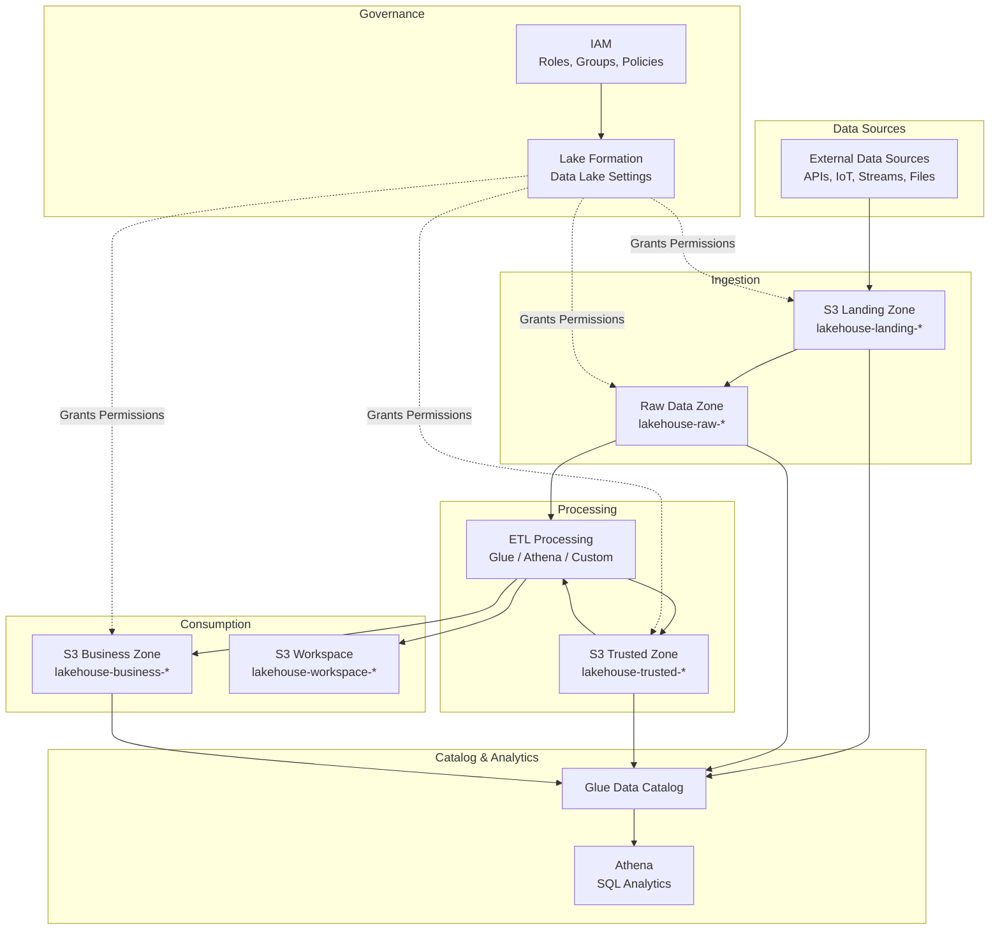
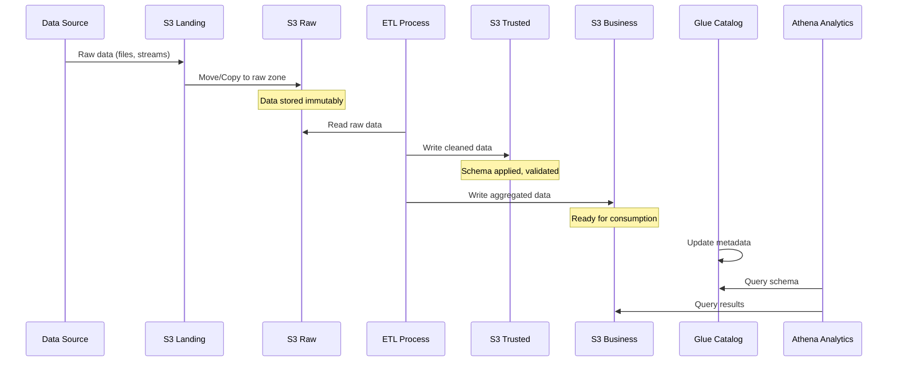
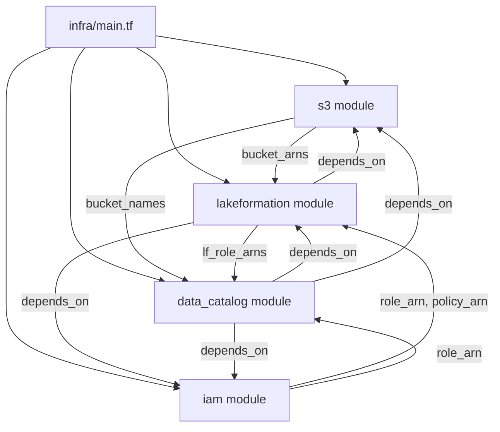
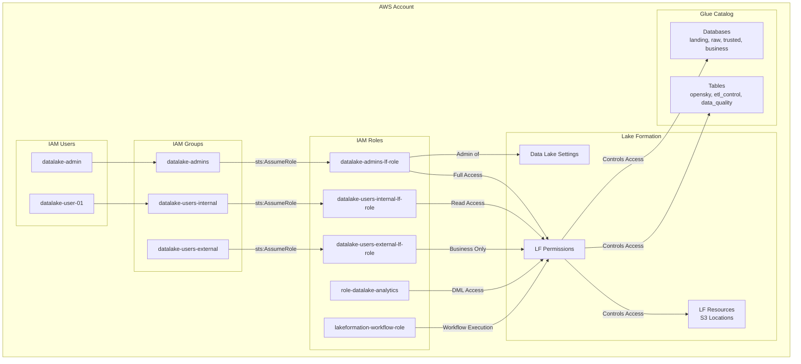

# Architecture — AWS Data Lakehouse

> **Detailed Architecture Reference** for the AWS Data Lakehouse.
> This document provides a comprehensive view of the system architecture,
> component interactions, and design decisions.

---

## System Overview

---

## Data Flow

### End-to-End Data Pipeline

---

## Module Architecture

### Module Dependency Graph

### Module Responsibilities

| Module | Responsibility | Key Resources |
|---|---|---|
| **s3** | Provision storage zones | `aws_s3_bucket`, `aws_s3_bucket_public_access_block`, `aws_s3_bucket_lifecycle_configuration`, `aws_s3_bucket_server_side_encryption_configuration` |
| **iam** | Create analytics role | `aws_iam_role`, `aws_iam_policy` |
| **lakeformation** | Governance & access control | `aws_lakeformation_data_lake_settings`, `aws_lakeformation_resource`, `aws_lakeformation_permissions`, `aws_iam_role`, `aws_iam_group`, `aws_iam_user`, `aws_iam_policy` |
| **data_catalog** | Metadata management | `aws_glue_catalog_database`, `aws_glue_catalog_table`, `aws_lakeformation_permissions` |

---

## Data Zones Detail

### Zone Characteristics

| Zone | Bucket | Access Pattern | Retention | Encryption |
|---|---|---|---|---|
| **Landing** | `lakehouse-landing-{account_id}` | Write: External sources. Read: ETL processes | Transient (tmp/ → 90d Glacier) | ⚠️ Not configured |
| **Raw** | `lakehouse-raw-{account_id}` | Append-only. Immutable data | Long-term (tmp/ → 90d Glacier) | ⚠️ Not configured |
| **Trusted** | `lakehouse-trusted-{account_id}` | Write: ETL. Read: Analytics | Long-term (tmp/ → 90d Glacier) | ⚠️ Not configured |
| **Business** | `lakehouse-business-{account_id}` | Write: ETL. Read: BI tools, Athena | Long-term (tmp/ → 90d Glacier) | ⚠️ Not configured |
| **Workspace** | `lakehouse-workspace-{account_id}` | Temporary ETL working area | Short-term | ✅ SSE-S3 (AES256) |

---

## IAM & Access Control Architecture

### Principal Hierarchy

### Policy Summary

| Policy Name | Type | Attached To | Purpose |
|---|---|---|---|
| `datalake-policy` | Customer managed | `role-datalake-analytics` | Cross-service data lake access |
| `AllowAssumeAdminRole` | Inline (group) | `datalake-admins` | `sts:AssumeRole` → admin LF role |
| `AllowAssumeInternalUserRole` | Inline (group) | `datalake-users-internal` | `sts:AssumeRole` → internal LF role |
| `AllowAssumeExternalUserRole` | Inline (group) | `datalake-users-external` | `sts:AssumeRole` → external LF role |
| `AdminLakeFormationPolicy` | Inline (role) | `datalake-admins-lf-role` | Full LF/Glue/IAM admin |
| `LFWorkflowSelfPassRole` | Customer managed | `lakeformation-workflow-role` | Self pass-role for workflows |
| `LFUserPassRole` | Customer managed | `datalake-admins` group | Pass LF service-linked role |
| `LFRamAccess` | Customer managed | `datalake-admins` group | RAM sharing for cross-account |
| `LFGovernedTablePolicy` | Customer managed | `datalake-users-internal` group | Governed table operations |
| `DatalakeInternalUserBasic` | Inline (group) | `datalake-users-internal` | Read-only Glue/LF access |
| `DatalakeExternalUserBasic` | Inline (group) | `datalake-users-external` | Read-only Glue/LF access |

---

## Network Architecture

**Currently:** All services are serverless (S3, Glue, Athena, Lake Formation, IAM) — no VPC configuration required.

**Future Considerations:**
- VPC endpoints (S3 Gateway, Glue, Lake Formation) for private access
- S3 access points for granular network controls
- AWS PrivateLink for cross-account analytics

---

## Data Catalog Schema

### Database: `db_landing`

*(No tables currently — reserved for future landing zone tables)*

### Database: `db_raw`

**Table: `opensky_flights`**
- **S3 Location:** `s3://{raw}/tables/opensky_flights/`
- **Format:** Parquet (Snappy compressed)
- **Partition:** `event_date` (date)

| Column | Type | Description |
|---|---|---|
| `icao24` | `string` | Transponder identifier |
| `callsign` | `string` | Flight callsign |
| `origin_country` | `string` | Origin country |
| `latitude` | `double` | Latitude coordinate |
| `longitude` | `double` | Longitude coordinate |
| `altitude` | `double` | Altitude in meters |
| `velocity` | `double` | Velocity in m/s |
| `heading` | `double` | Heading in degrees |
| `last_contact` | `bigint` | Last contact timestamp |
| `event_time` | `string` | Event timestamp |
| `location` | `string` | Location description |
| **Partition** | | |
| `event_date` | `date` | Flight date |

**Table: `etl_execution_control`**
| Column | Type | Description |
|---|---|---|
| `target_table_name` | `string` | Target table name |
| `execution_start_timestamp` | `timestamp` | Execution start |
| `execution_end_timestamp` | `timestamp` | Execution end |
| `target_partition` | `string` | Target partition |
| `source_tables` | `array<struct<...>>` | Source tables & partitions |
| **Partition** | | |
| `reference_date` | `date` | Reference date |

**Table: `data_quality_metrics`**
| Column | Type | Description |
|---|---|---|
| `database` | `string` | Database name |
| `processing_timestamp` | `timestamp` | Processing timestamp |
| `metric` | `string` | Metric type |
| `failure_reason` | `string` | Failure reason |
| `status` | `string` | Evaluation status |
| `partition` | `string` | Partition evaluated |
| `rule` | `string` | Quality rule applied |
| `table` | `string` | Table evaluated |
| `technology` | `string` | Technology used |
| **Partition** | | |
| `reference_date` | `date` | Reference date |

---

## Design Decisions

### Decision 1: LF Roles instead of IAM Groups as Principals

**Context:** Lake Formation does not support IAM Groups as principals for permission grants.

**Decision:** Create dedicated IAM roles per access level (`datalake-admins-lf-role`, `datalake-users-internal-lf-role`, `datalake-users-external-lf-role`) and use `sts:AssumeRole` from group policies.

**Consequences:**
- ✅ Lake Formation permissions work correctly
- ✅ Group membership controls role access
- ⚠️ Additional IAM roles to manage
- ⚠️ Users must assume role after login

### Decision 2: Separate Buckets per Zone

**Context:** Medallion architecture requires distinct storage zones.

**Decision:** Create 5 separate S3 buckets instead of using prefixes in a single bucket.

**Consequences:**
- ✅ Clear isolation between zones
- ✅ Independent lifecycle and encryption policies
- ✅ Easier Lake Formation resource registration
- ⚠️ Higher bucket count to manage

### Decision 3: Parquet Format with Snappy Compression

**Context:** Glue tables need efficient storage and query performance.

**Decision:** Use Parquet with Snappy compression for all Glue tables.

**Consequences:**
- ✅ Columnar storage for efficient Athena queries
- ✅ Snappy balances compression ratio and speed
- ✅ Industry standard for AWS analytics
