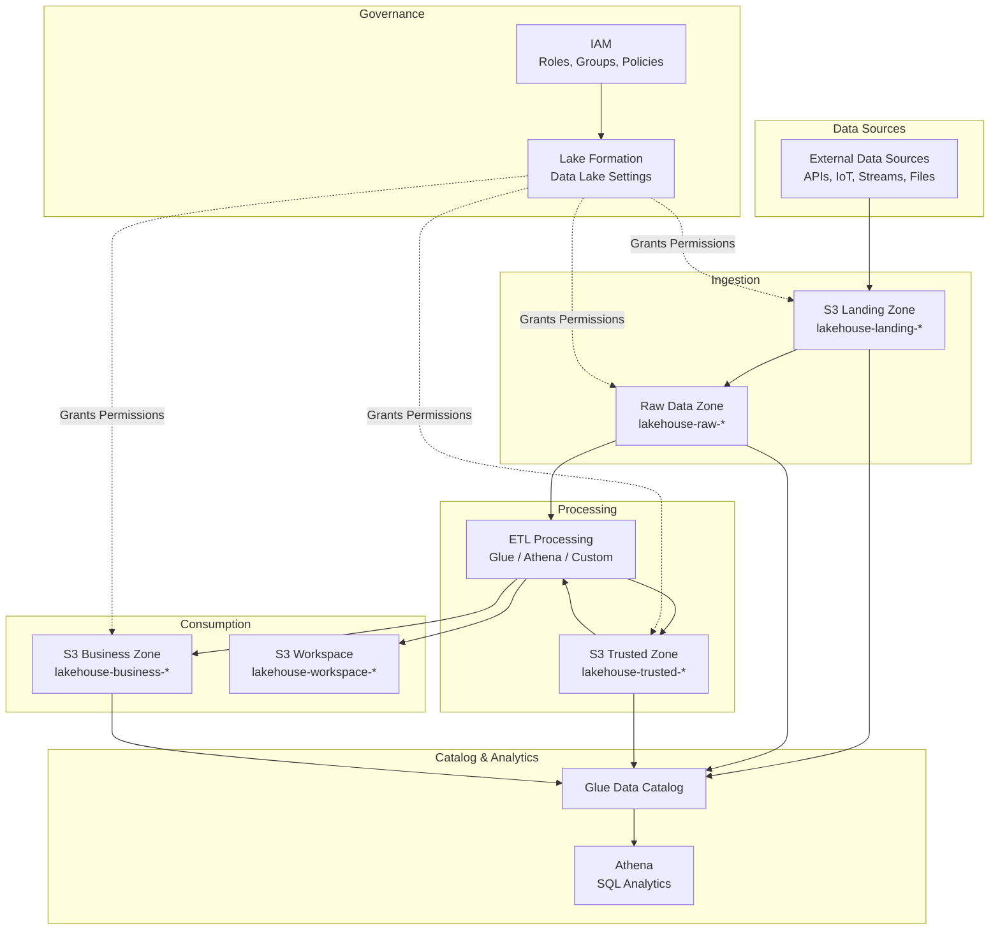
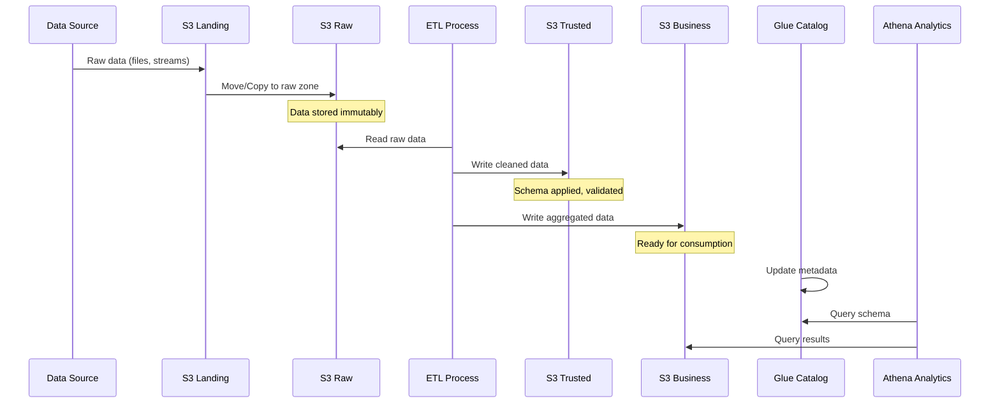
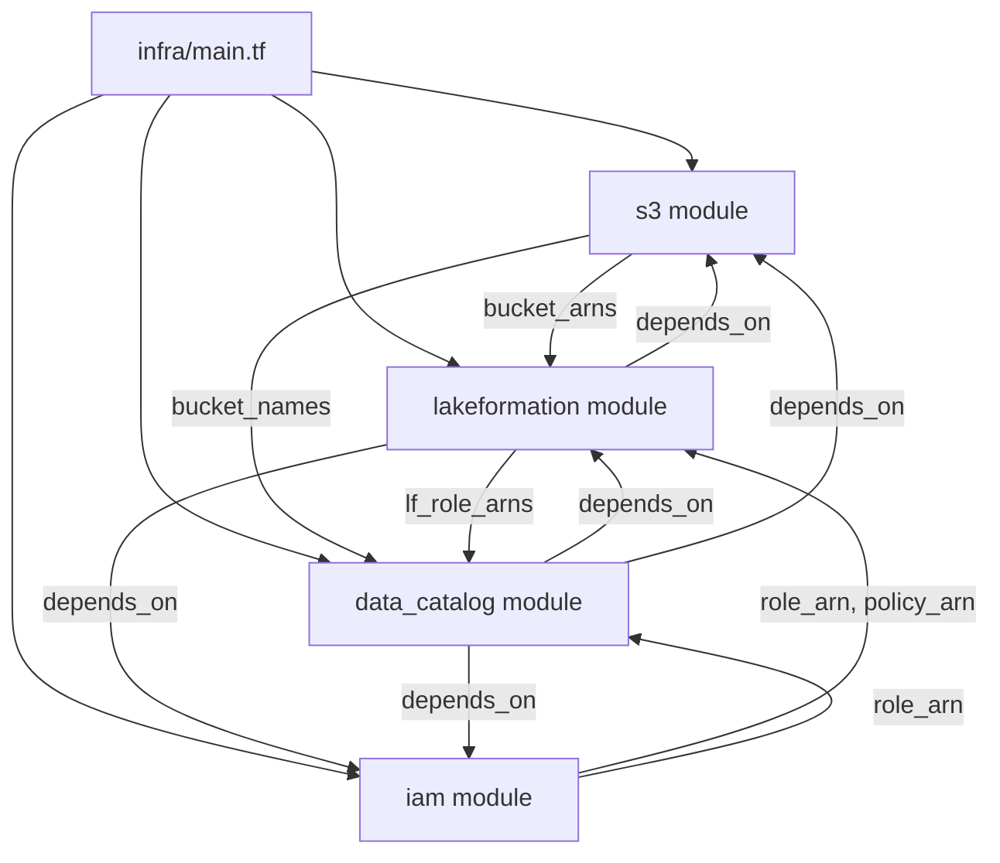
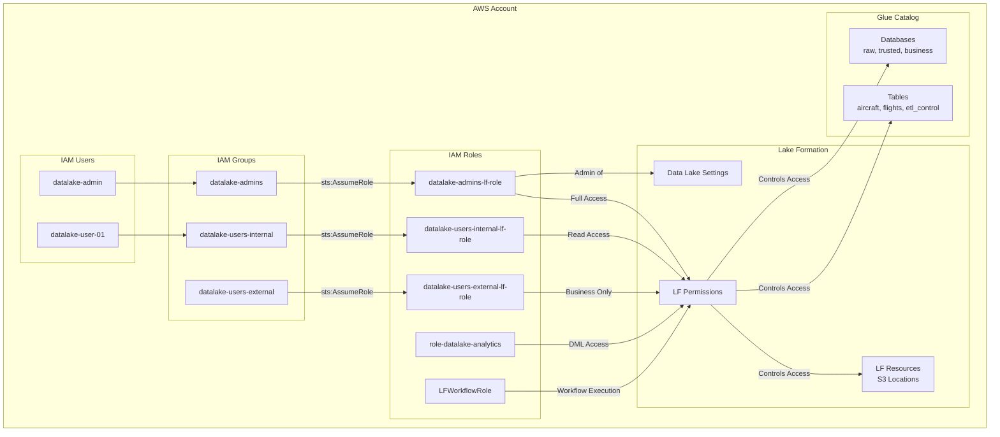

# Architecture — AWS Data Lakehouse

> **Detailed Architecture Reference** for the AWS Data Lakehouse.
> This document provides a comprehensive view of the system architecture,
> component interactions, and design decisions.

---

## System Overview

```mermaid
graph TB
    subgraph "Data Sources"
        A[External Data Sources<br/>APIs, IoT, Streams, Files]
    end

    subgraph "Ingestion"
        B[S3 Landing Zone<br/>lakehouse-landing-*]
        C[Raw Data Zone<br/>lakehouse-raw-*]
    end

    subgraph "Processing"
        D[ETL Processing<br/>Glue / Athena / Custom]
        E[S3 Trusted Zone<br/>lakehouse-trusted-*]
    end

    subgraph "Consumption"
        F[S3 Business Zone<br/>lakehouse-business-*]
        G[S3 Workspace<br/>lakehouse-workspace-*]
    end

    subgraph "Governance"
        H[Lake Formation<br/>Data Lake Settings]
        I[IAM<br/>Roles, Groups, Policies]
    end

    subgraph "Catalog & Analytics"
        J[Glue Data Catalog]
        K[Athena<br/>SQL Analytics]
    end

    A --> B
    B --> C
    C --> D
    D --> E
    E --> D
    D --> F
    D --> G
    H -.->|Grants Permissions| B
    H -.->|Grants Permissions| C
    H -.->|Grants Permissions| E
    H -.->|Grants Permissions| F
    I --> H
    J --> K
    B --> J
    C --> J
    E --> J
    F --> J
```

---

## Data Flow

### End-to-End Data Pipeline

```mermaid
sequenceDiagram
    participant Source as Data Source
    participant Landing as S3 Landing
    participant Raw as S3 Raw
    participant ETL as ETL Process
    participant Trusted as S3 Trusted
    participant Business as S3 Business
    participant Catalog as Glue Catalog
    participant Athena as Athena Analytics

    Source->>Landing: Raw data (files, streams)
    Landing->>Raw: Move/Copy to raw zone
    Note over Raw: Data stored immutably
    ETL->>Raw: Read raw data
    ETL->>Trusted: Write cleaned data
    Note over Trusted: Schema applied, validated
    ETL->>Business: Write aggregated data
    Note over Business: Ready for consumption
    Catalog->>Catalog: Update metadata
    Athena->>Catalog: Query schema
    Athena->>Business: Query results
```

---

## Module Architecture

### Module Dependency Graph

```mermaid
graph TD
    Root[infra/main.tf] --> S3[s3 module]
    Root --> IAM[iam module]
    Root --> LF[lakeformation module]
    Root --> Catalog[data_catalog module]
    
    IAM -->|role_arn, policy_arn| LF
    S3 -->|bucket_arns| LF
    IAM -->|role_arn| Catalog
    S3 -->|bucket_names| Catalog
    LF -->|lf_role_arns| Catalog
    
    LF -->|depends_on| IAM
    LF -->|depends_on| S3
    Catalog -->|depends_on| IAM
    Catalog -->|depends_on| LF
    Catalog -->|depends_on| S3
```

### Module Responsibilities

| Module | Responsibility | Key Resources |
|---|---|---|
| **s3** | Provision storage zones | `aws_s3_bucket`, `aws_s3_bucket_public_access_block`, `aws_s3_bucket_lifecycle_configuration`, `aws_s3_bucket_server_side_encryption_configuration` |
| **iam** | Create analytics role | `aws_iam_role`, `aws_iam_policy` |
| **lakeformation** | Governance & access control | `aws_lakeformation_data_lake_settings`, `aws_lakeformation_resource`, `aws_lakeformation_permissions`, `aws_iam_role`, `aws_iam_group`, `aws_iam_user`, `aws_iam_policy` |
| **data_catalog** | Metadata management | `aws_glue_catalog_database`, `aws_glue_catalog_table`, `aws_lakeformation_permissions` |

---

## Data Zones Detail

### Zone Characteristics

| Zone | Bucket | Access Pattern | Retention | Encryption |
|---|---|---|---|---|
| **Landing** | `lakehouse-landing-{account_id}` | Write: External sources. Read: ETL processes | Transient (tmp/ → 90d Glacier) | ⚠️ Not configured |
| **Raw** | `lakehouse-raw-{account_id}` | Append-only. Immutable data | Long-term (tmp/ → 90d Glacier) | ⚠️ Not configured |
| **Trusted** | `lakehouse-trusted-{account_id}` | Write: ETL. Read: Analytics | Long-term (tmp/ → 90d Glacier) | ⚠️ Not configured |
| **Business** | `lakehouse-business-{account_id}` | Write: ETL. Read: BI tools, Athena | Long-term (tmp/ → 90d Glacier) | ⚠️ Not configured |
| **Workspace** | `lakehouse-workspace-{account_id}` | Temporary ETL working area | Short-term | ✅ SSE-S3 (AES256) |

---

## IAM & Access Control Architecture

### Principal Hierarchy

```mermaid
graph TD
    subgraph "AWS Account"
        subgraph "IAM Users"
            Admin[datalake-admin]
            User1[datalake-user-01]
        end

        subgraph "IAM Groups"
            GAdmin[datalake-admins]
            GInternal[datalake-users-internal]
            GExternal[datalake-users-external]
        end

        subgraph "IAM Roles"
            RAdmin[datalake-admins-lf-role]
            RInternal[datalake-users-internal-lf-role]
            RExternal[datalake-users-external-lf-role]
            RWorkflow[LFWorkflowRole]
            RService[role-datalake-analytics]
        end

        subgraph "Lake Formation"
            LFSettings[Data Lake Settings]
            LFPerms[LF Permissions]
            LFResources[LF Resources<br/>S3 Locations]
        end

        subgraph "Glue Catalog"
            GLDB[Databases<br/>raw, trusted, business]
            GLTables[Tables<br/>aircraft, flights, etl_control]
        end

        Admin --> GAdmin
        User1 --> GInternal
        
        GAdmin -->|sts:AssumeRole| RAdmin
        GInternal -->|sts:AssumeRole| RInternal
        GExternal -->|sts:AssumeRole| RExternal

        RAdmin -->|Admin of| LFSettings
        RAdmin -->|Full Access| LFPerms
        RInternal -->|Read Access| LFPerms
        RExternal -->|Business Only| LFPerms
        
        RService -->|DML Access| LFPerms
        RWorkflow -->|Workflow Execution| LFPerms

        LFPerms -->|Controls Access| LFResources
        LFPerms -->|Controls Access| GLDB
        LFPerms -->|Controls Access| GLTables
    end
```

### Policy Summary

| Policy Name | Type | Attached To | Purpose |
|---|---|---|---|
| `datalake-policy` | Customer managed | `role-datalake-analytics` | S3 access to the data lake zones |
| `AllowAssumeAdminRole` | Inline (group) | `datalake-admins` | `sts:AssumeRole` → admin LF role |
| `AllowAssumeInternalUserRole` | Inline (group) | `datalake-users-internal` | `sts:AssumeRole` → internal LF role |
| `AllowAssumeExternalUserRole` | Inline (group) | `datalake-users-external` | `sts:AssumeRole` → external LF role |
| `AdminLakeFormationPolicy` | Inline (role) | `datalake-admins-lf-role` | Full LF/Glue/IAM admin |
| `InternalUserLakeFormationPolicy` | Inline (role) | `datalake-users-internal-lf-role` | Read access to catalog and S3 |
| `ExternalUserLakeFormationPolicy` | Inline (role) | `datalake-users-external-lf-role` | Read access to business catalog |
| `DatalakeInternalUserBasic` | Inline (group) | `datalake-users-internal` | Read-only Glue/LF access |
| `DatalakeExternalUserBasic` | Inline (group) | `datalake-users-external` | Read-only Glue/LF access |
| `DatalakeExternalUserAthenaReadOnly` | Inline (group) | `datalake-users-external` | Read-only Athena queries |
| `LakeFormationSLR` | Inline (group) | `datalake-admins` | Create and manage the LF service-linked role |
| `LFWorkflowSelfPassRole` | Customer managed | `LFWorkflowRole` | Self pass-role for workflows |
| `LFUserPassRole` | Customer managed | `datalake-admins` | Pass LF service-linked role |
| `LFRamAccess` | Customer managed | `datalake-admins` | RAM sharing for cross-account |
| `LFGovernedTablePolicy` | Customer managed | `datalake-users-internal` | Governed table operations |

---

## Network Architecture

**Currently:** All services are serverless (S3, Glue, Athena, Lake Formation, IAM) — no VPC configuration required.

**Future Considerations:**
- VPC endpoints (S3 Gateway, Glue, Lake Formation) for private access
- S3 access points for granular network controls
- AWS PrivateLink for cross-account analytics

---

## Data Catalog Schema

### Database: `db_raw`

**Delta Lake tables** (bronze layer) — CDC from Aurora PostgreSQL via DMS. Partitioned by `event_date` (date). Snappy-compressed Parquet files managed by Delta Lake.

| Table | Source | Columns |
|---|---|---|
| `tbl_aircraft` | `flight_radar.aircraft` | `icao24`, `registration`, `aircraft_type`, `serial_number`, `operator_icao`, `operator_name`, `year_built`, `created_at`, `updated_at`, `cdc_operation`, `cdc_timestamp`, `cod_unico` |
| `tbl_airports` | `flight_radar.airports` | `id`, `ident`, `type`, `name`, `latitude_deg`, `longitude_deg`, `elevation_ft`, `continent`, `iso_country`, `iso_region`, `municipality`, `scheduled_service`, `icao_code`, `iata_code`, `gps_code`, `local_code`, `home_link`, `wikipedia_link`, `cdc_operation`, `cdc_timestamp`, `cod_unico` |
| `tbl_airlines` | `flight_radar.airlines` | `id`, `name`, `alias`, `iata_code`, `icao_code`, `callsign`, `country`, `is_active`, `created_at`, `cdc_operation`, `cdc_timestamp`, `cod_unico` |
| `tbl_flights` | `flight_radar.flights` | `flight_id`, `flight_number`, `airline_icao`, `aircraft_icao24`, `origin_airport`, `destination_airport`, `scheduled_departure`, `scheduled_arrival`, `actual_departure`, `actual_arrival`, `status`, `created_at`, `updated_at`, `cdc_operation`, `cdc_timestamp`, `cod_unico` |
| `tbl_aircraft_positions` | `flight_radar.aircraft_positions` | `position_id`, `aircraft_icao24`, `flight_id`, `latitude`, `longitude`, `altitude_ft`, `velocity_kts`, `heading`, `vertical_rate_fpm`, `on_ground`, `recorded_at`, `ingested_at`, `cdc_operation`, `cdc_timestamp`, `cod_unico` |
| `tbl_countries` | `flight_radar.countries` | `id`, `code`, `name`, `continent`, `wikipedia_link`, `cdc_operation`, `cdc_timestamp`, `cod_unico` |
| `tbl_aircraft_types` | `flight_radar.aircraft_types` | `icao_code`, `iata_code`, `name`, `manufacturer`, `cdc_operation`, `cdc_timestamp`, `cod_unico` |
| `tbl_routes` | `flight_radar.routes` | `id`, `airline_iata`, `airline_id`, `src_airport`, `src_airport_id`, `dst_airport`, `dst_airport_id`, `codeshare`, `stops`, `equipment`, `duration_minutes`, `created_at`, `cdc_operation`, `cdc_timestamp`, `cod_unico` |

> `tbl_aircraft_positions` adds a second partition key `hour` (int) for sub-daily partition pruning.

**Parquet tables** (pipeline control, written by Glue ETL). Partitioned by `reference_date` (date).

| Table | Purpose | Columns |
|---|---|---|
| `etl_control` | Pipeline execution control | `execution_id`, `job_name`, `source`, `execution_start`, `execution_end`, `status`, `records_read`, `records_written`, `records_rejected`, `target_partition`, `error_message` |
| `data_quality_metrics` | Data quality checks | `database`, `table`, `processing_timestamp`, `metric`, `rule`, `status`, `failure_reason`, `partition`, `technology` |

---

## Design Decisions

### Decision 1: LF Roles instead of IAM Groups as Principals

**Context:** Lake Formation does not support IAM Groups as principals for permission grants.

**Decision:** Create dedicated IAM roles per access level (`datalake-admins-lf-role`, `datalake-users-internal-lf-role`, `datalake-users-external-lf-role`) and use `sts:AssumeRole` from group policies.

**Consequences:**
- ✅ Lake Formation permissions work correctly
- ✅ Group membership controls role access
- ⚠️ Additional IAM roles to manage
- ⚠️ Users must assume role after login

### Decision 2: Separate Buckets per Zone

**Context:** Medallion architecture requires distinct storage zones.

**Decision:** Create 5 separate S3 buckets instead of using prefixes in a single bucket.

**Consequences:**
- ✅ Clear isolation between zones
- ✅ Independent lifecycle and encryption policies
- ✅ Easier Lake Formation resource registration
- ⚠️ Higher bucket count to manage

### Decision 3: Delta Lake for Bronze, Parquet for Control Tables

**Context:** Bronze tables receive CDC streams from Aurora PostgreSQL via DMS and need ACID semantics, while pipeline control tables are appended by Glue ETL jobs.

**Decision:** Use Delta Lake for bronze tables (with `spark.sql.sources.provider = delta`) and Parquet with Snappy compression for `etl_control` and `data_quality_metrics`.

**Consequences:**
- ✅ ACID transactions and time travel on bronze CDC data
- ✅ Columnar storage for efficient Athena queries
- ✅ Snappy balances compression ratio and speed
