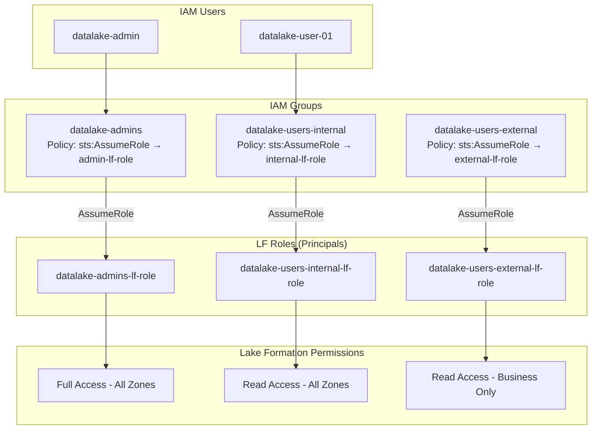
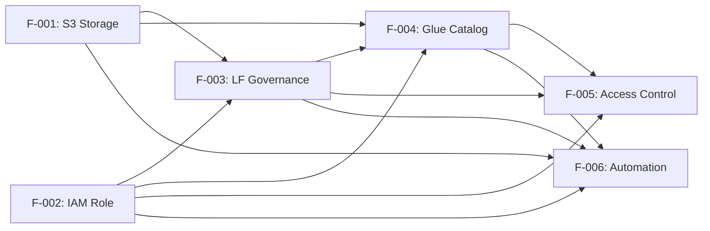

# Feature — AWS Data Lakehouse Specifications

> **Feature Specifications** for the AWS Data Lakehouse.
> Each feature describes a unit of functionality implemented via Terraform modules.

---

## Feature Index

| ID | Feature | Module | Status |
|---|---|---|---|
| F-001 | S3 Storage Zones | `s3` | ✅ Implemented |
| F-002 | IAM Data Lake Role & Policy | `iam` | ✅ Implemented |
| F-003 | Lake Formation Governance | `lakeformation` | ✅ Implemented |
| F-004 | Glue Data Catalog | `data_catalog` | ✅ Implemented |
| F-005 | Access Control Model | `lakeformation` + `data_catalog` | ✅ Implemented |
| F-006 | Deployment Automation | Root scripts | ✅ Implemented |

---

## F-001: S3 Storage Zones

### Description
Provision 5 S3 buckets following the medallion architecture pattern for data lake zones.

### Specification

**Bucket Naming Convention:** `{prefix}-{zone}-{account_id}`  
*Example:* `lakehouse-raw-123456789012`

### Zones

| Zone | Bucket Name Prefix | Purpose | Lifecycle (tmp/) |
|---|---|---|---|
| Workspace | `lakehouse-workspace-*` | ETL working area, notebooks | 60d → STANDARD_IA, 90d → GLACIER |
| Landing | `lakehouse-landing-*` | Raw data ingestion landing | 60d → STANDARD_IA, 90d → GLACIER |
| Raw | `lakehouse-raw-*` | Bronze layer — raw immutable data | 60d → STANDARD_IA, 90d → GLACIER |
| Trusted | `lakehouse-trusted-*` | Silver layer — cleaned/transformed | 60d → STANDARD_IA, 90d → GLACIER |
| Business | `lakehouse-business-*` | Gold layer — business-ready aggregates | 60d → STANDARD_IA, 90d → GLACIER |

### Configuration

| Setting | Value |
|---|---|
| `force_destroy` | `true` (non-production) |
| `block_public_acls` | `true` |
| `block_public_policy` | `true` |
| `ignore_public_acls` | `true` |
| `restrict_public_buckets` | `true` |
| Encryption | `AES256` (workspace only currently) |
| Lifecycle rule | `tmp/` prefix → STANDARD_IA at 60d → GLACIER at 90d |

### Acceptance Criteria
- [x] 5 buckets created with configured naming
- [x] All public access blocked
- [x] Lifecycle policies applied to all buckets
- [x] Encryption configured on workspace bucket
- [x] Bucket ARNs exposed as module outputs

### Files
`infra/modules/s3/main_bucket_*.tf`

---

## F-002: IAM Data Lake Role & Policy

### Description
Create a unified IAM role and policy for data lake analytics services.

### Specification

**Role:** `role-datalake-analytics`

**Trusted Entities (Services):**
- `glue.amazonaws.com`
- `states.amazonaws.com`
- `athena.amazonaws.com`
- `s3.amazonaws.com`
- `sns.amazonaws.com`
- `sqs.amazonaws.com`
- `firehose.amazonaws.com`

**Policy:** `datalake-policy`

### Permissions Matrix

| Service | Actions | Scope |
|---|---|---|
| S3 | `ListBucket`, `GetBucketLocation`, `GetObject`, `PutObject`, `PutObjectAcl`, `DeleteObject` | `lakehouse-*-*` buckets |
| Glue | `GetDatabase`, `GetTable`, `CreateTable`, `UpdateTable`, `DeleteTable`, `GetPartition`, `CreatePartition`, `DeletePartition` | `*` |
| Athena | `StartQueryExecution`, `GetQueryExecution`, `GetQueryResults` | `*` |
| Step Functions | `StartExecution`, `StopExecution`, `DescribeExecution`, `ListExecutions` | `*` |
| SNS | `Publish`, `Subscribe` | `*` |
| SQS | `SendMessage`, `ReceiveMessage`, `DeleteMessage`, `GetQueueAttributes` | `*` |
| Lake Formation | `GetDataAccess`, `GrantPermissions`, `RevokePermissions` | `*` |

### Acceptance Criteria
- [x] IAM role created with multi-service trust policy
- [x] IAM policy covers all required service actions
- [x] Role ARN exposed as module output
- [x] Policy ARN exposed as module output

### Files
`infra/modules/iam/main_role_datalake_analytics.tf`

---

## F-003: Lake Formation Governance

### Description
Centralized data governance using AWS Lake Formation, including resource registration, admin configuration, IAM group/role/user management, and location permissions.

### Specification

#### Sub-features

**F-003.1: Data Lake Settings**
- Single admin principal: `datalake-admins-lf-role`

**F-003.2: S3 Location Registration**
- Register raw, trusted, business bucket ARNs as LF resources
- Use service-linked role for data access

**F-003.3: IAM Groups (3-tier access model)**

| Group | Purpose | LF Role to Assume |
|---|---|---|
| `datalake-admins` | Full administrative access | `datalake-admins-lf-role` |
| `datalake-users-internal` | Read-only internal access | `datalake-users-internal-lf-role` |
| `datalake-users-external` | Read-only external (business only) | `datalake-users-external-lf-role` |

**F-003.4: IAM Roles (LF Principals)**

| Role | Trust Policy | Purpose |
|---|---|---|
| `datalake-admins-lf-role` | Root account trust | Admin LF principal |
| `datalake-users-internal-lf-role` | Root account trust | Internal user LF principal |
| `datalake-users-external-lf-role` | Root account trust | External user LF principal |
| `lakeformation-workflow-role` | Root account trust | ETL workflow execution |

**F-003.5: IAM Users**

| User | Group Membership |
|---|---|
| `datalake-admin` | `datalake-admins` |
| `datalake-user-01` | `datalake-users-internal` |

**F-003.6: Location Permissions**
- `DATA_LOCATION_ACCESS` grants for each principal × bucket combination:

| Principal | Landing | Raw | Trusted | Business |
|---|---|---|---|---|
| `datalake-admins-lf-role` | ❌ | ✅ | ✅ | ✅ |
| `datalake-users-internal-lf-role` | ❌ | ✅ | ✅ | ✅ |
| `datalake-users-external-lf-role` | ❌ | ❌ | ❌ | ✅ |
| `datalake-role-arn` (service role) | ❌ | ✅ | ✅ | ✅ |

### Acceptance Criteria
- [x] Lake Formation Data Lake Settings configured
- [x] S3 buckets registered as LF resources
- [x] 3 IAM groups created with `sts:AssumeRole` policies
- [x] 4 IAM roles created (3 LF + 1 workflow)
- [x] 2 IAM users created and assigned to groups
- [x] Location permissions granted to all principals
- [x] All auxiliary policies created and attached

### Files
`infra/modules/lakeformation/main_*.tf`

---

## F-004: Glue Data Catalog

### Description
Create and manage AWS Glue Catalog databases and tables for metadata management, with Lake Formation permissions.

### Specification

#### Databases

| Database | S3 Location | Purpose |
|---|---|---|
| `db_landing` | `s3://lakehouse-landing-*/` | Landing zone metadata |
| `db_raw` | `s3://lakehouse-raw-*/` | Raw zone metadata |
| `db_trusted` | `s3://lakehouse-trusted-*/` | Trusted zone metadata |
| `db_business` | `s3://lakehouse-business-*/` | Business zone metadata |

#### Tables

**T-001: `opensky_flights`** (Raw Database)
- Format: Parquet (Snappy compressed)
- Partition: `event_date` (date)
- Location: `s3://{raw}/tables/opensky_flights/`
- Database: `db_raw`
- Columns: `icao24`, `callsign`, `origin_country`, `latitude`, `longitude`, `altitude`, `velocity`, `heading`, `last_contact`, `event_time`, `location`

**T-002: `etl_execution_control`** (Raw Zone)
- Format: Parquet
- Partition: `reference_date` (date)
- Location: `s3://{raw}/tables/etl_control/`
- Columns: `target_table_name`, `execution_start_timestamp`, `execution_end_timestamp`, `target_partition`, `source_tables` (array of structs)

**T-003: `data_quality_metrics`** (Raw Zone)
- Format: Parquet
- Partition: `reference_date` (date)
- Location: `s3://{raw}/tables/data_quality_metrics/`
- Columns: `database`, `processing_timestamp`, `metric`, `failure_reason`, `status`, `partition`, `rule`, `table`, `technology`

### Lake Formation Permissions on Catalog

**Database Level:** All principals get `DESCRIBE` on their authorized databases.

**Table Level:**

| Principal | Landing | Raw | Trusted | Business |
|---|---|---|---|---|
| `datalake-role-arn` (service) | SELECT, INSERT, ALTER, DELETE | Full DML | Full DML | Full DML |
| `datalake-admins-lf-role` | SELECT, INSERT, ALTER, DELETE | Full DML | Full DML | Full DML |
| `datalake-users-internal-lf-role` | DESCRIBE, SELECT | DESCRIBE, SELECT | DESCRIBE, SELECT | DESCRIBE, SELECT |
| `datalake-users-external-lf-role` | ❌ | ❌ | ❌ | DESCRIBE, SELECT |

### Acceptance Criteria
- [x] 4 Glue databases created with correct locations
- [x] 3 Glue tables created with correct schemas and partitions
- [x] Database-level DESCRIBE permissions granted
- [x] Table-level permissions granted per 3-tier model
- [x] Service role has full DML access to all tables

### Files
`infra/modules/data_catalog/*.tf`

---

## F-005: Access Control Model (3-Tier)

### Description
Role-based access control model implemented through IAM groups, LF roles, and Lake Formation permissions.

### Architecture

### Rationale
Lake Formation does not support IAM Groups as principals directly. The workaround is:
1. Create IAM Groups with `sts:AssumeRole` policies targeting LF-specific roles
2. Use the LF roles as principals in Lake Formation permissions
3. Users authenticate via their IAM user, inherit group policy, assume the LF role

### Acceptance Criteria
- [x] Users can assume correct LF role via group membership
- [x] LF roles have correct permissions in Lake Formation
- [x] External users restricted to business database only

---

## F-006: Deployment Automation

### Description
Shell scripts for automated deployment and teardown with proper role assumption.

### Scripts

**`setup.sh`**
- Loads `.env` file
- Assumes `datalake-admins-lf-role` via `sts:assume-role`
- Runs `terraform init`, `validate`, `plan`, `apply`
- Validates deployment (groups, roles, databases)

**`destroy.sh`**
- Loads `.env` file
- Assumes `datalake-admins-lf-role`
- Runs `terraform destroy -auto-approve`

### Acceptance Criteria
- [x] Scripts idempotent
- [x] Role assumption handled gracefully (skip if already correct role)
- [x] Post-deploy validation checks
- [x] Error handling with clear messages

---

## Feature Dependency Graph

