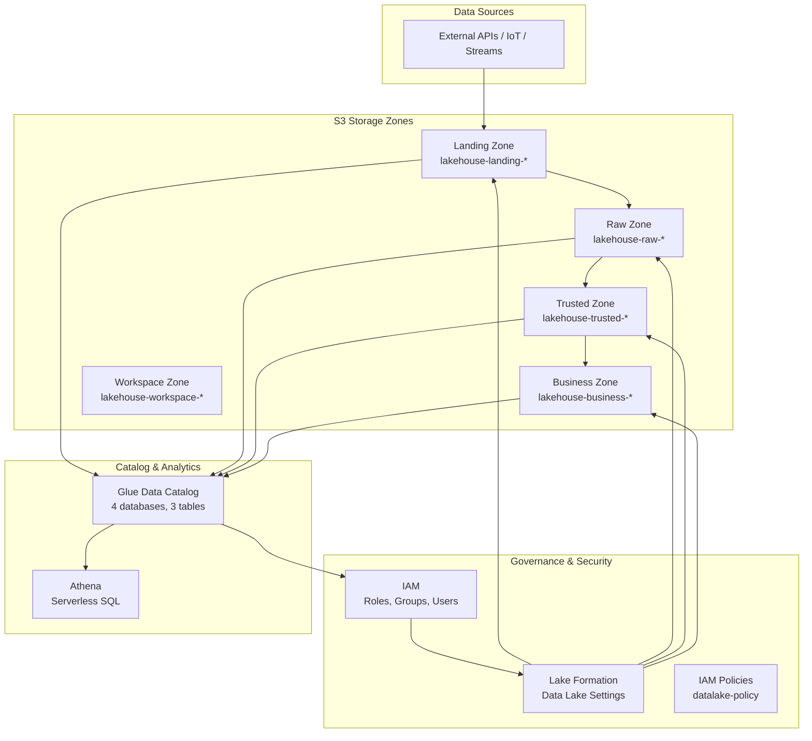

# Plan — AWS Data Lakehouse SDD

> **Development Roadmap** for the AWS Data Lakehouse infrastructure project.
> This document defines the progressive implementation plan following Spec-Driven Development principles.

---

## Project Overview

**Objective:** Implement a modular, production-ready Data Lakehouse architecture on AWS using Terraform.

**Key AWS Services:**
| Service | Role |
|---|---|
| S3 | Multi-zone storage (landing, raw, trusted, business, workspace) |
| IAM | Users, groups, roles, and policies for access control |
| Lake Formation | Centralized data governance and permission management |
| Glue Data Catalog | Metadata catalog for data discovery and query |
| Athena | Serverless SQL analytics |

**Repository:** `https://github.com/jamilvilela/aws-data-lakehouse`

---

## Implementation Roadmap

### Phase 1: Foundation — S3 Storage Layer ✅

| Step | Module | Description | Status |
|---|---|---|---|
| 1.1 | S3 | Create `main_bucket_workspace.tf` | ✅ Complete |
| 1.2 | S3 | Create `main_bucket_landing.tf` | ✅ Complete |
| 1.3 | S3 | Create `main_bucket_raw.tf` | ✅ Complete |
| 1.4 | S3 | Create `main_bucket_trusted.tf` | ✅ Complete |
| 1.5 | S3 | Create `main_bucket_business.tf` | ✅ Complete |
| 1.6 | S3 | Configure public access blocks (all buckets) | ✅ Complete |
| 1.7 | S3 | Configure lifecycle policies (tmp/ → IA → Glacier) | ✅ Complete |
| 1.8 | S3 | Enable SSE-S3 encryption (workspace bucket) | ✅ Complete |

**Files:** `infra/modules/s3/`

---

### Phase 2: Identity — IAM Layer ✅

| Step | Module | Description | Status |
|---|---|---|---|
| 2.1 | IAM | Create `role-datalake-analytics` (multi-service trust) | ✅ Complete |
| 2.2 | IAM | Create `datalake-policy` (S3, Glue, Athena, LF, SNS, SQS, Step Functions) | ✅ Complete |

**Files:** `infra/modules/iam/`

**Trusted Services:**
- `glue.amazonaws.com`
- `states.amazonaws.com` (Step Functions)
- `athena.amazonaws.com`
- `s3.amazonaws.com`
- `sns.amazonaws.com`
- `sqs.amazonaws.com`
- `firehose.amazonaws.com`

---

### Phase 3: Governance — Lake Formation ✅

| Step | Module | Description | Status |
|---|---|---|---|
| 3.1 | LF | Register S3 locations as LF resources | ✅ Complete |
| 3.2 | LF | Configure Data Lake Settings (admins) | ✅ Complete |
| 3.3 | LF | Create IAM roles per access level (3 roles) | ✅ Complete |
| 3.4 | LF | Create IAM groups per access level (3 groups) | ✅ Complete |
| 3.5 | LF | Create IAM users (admin + user1) | ✅ Complete |
| 3.6 | LF | Attach policies to groups | ✅ Complete |
| 3.7 | LF | Grant DATA_LOCATION_ACCESS permissions | ✅ Complete |

**Access Levels:**

| Group | LF Role | Access Scope |
|---|---|---|
| `datalake-admins` | `datalake-admins-lf-role` | Full admin (all zones, all operations) |
| `datalake-users-internal` | `datalake-users-internal-lf-role` | Read-only (all zones) |
| `datalake-users-external` | `datalake-users-external-lf-role` | Read-only (business zone only) |

**Key Design Decision:** Lake Formation does not support IAM Groups as principals.  
**Solution:** Users assume LF-specific roles via `sts:AssumeRole` through group policies. The LF roles are the principals in Lake Formation permissions.

---

### Phase 4: Catalog — Glue Data Catalog ✅

| Step | Module | Description | Status |
|---|---|---|---|
| 4.1 | Catalog | Create Glue databases (landing, raw, trusted, business) | ✅ Complete |
| 4.2 | Catalog | Create `opensky_flights` table (landing, parquet) | ✅ Complete |
| 4.3 | Catalog | Create `etl_execution_control` table (raw, parquet) | ✅ Complete |
| 4.4 | Catalog | Create `data_quality_metrics` table (raw, parquet) | ✅ Complete |
| 4.5 | Catalog | Grant LF database-level permissions | ✅ Complete |
| 4.6 | Catalog | Grant LF table-level permissions | ✅ Complete |

**Partitioning Strategy:** All tables use date-based partitioning (`event_date` or `reference_date`).

---

### Phase 5: Automation & Scripts ✅

| Step | Description | Status |
|---|---|---|
| 5.1 | `setup.sh` — Full deploy with role assumption | ✅ Complete |
| 5.2 | `destroy.sh` — Full teardown with role assumption | ✅ Complete |
| 5.3 | `.env` loading and validation | ✅ Complete |
| 5.4 | Post-deploy validation (groups, roles, databases) | ✅ Complete |

---

### Phase 6: Documentation & SDD 🚧 (Current)

| Step | Description | Status |
|---|---|---|
| 6.1 | Reverse engineer existing Terraform into SDD docs | ✅ Complete |
| 6.2 | Create `agents.md` — AI agent definitions | ✅ Complete |
| 6.3 | Create `plan.md` — Development roadmap | ✅ Complete |
| 6.4 | Create `prod.md` — Production readiness | 🚧 In Progress |
| 6.5 | Create `feature.md` — Feature specifications | ⬜ Pending |
| 6.6 | Create `skill.md` — Agent skills | ⬜ Pending |
| 6.7 | Create ADRs for key decisions | ⬜ Pending |

---

### Phase 7: Enhancements (Future)

| Step | Description | Priority |
|---|---|---|
| 7.1 | Remote Terraform state (S3 + DynamoDB) | High |
| 7.2 | Terraform Workspaces for multi-environment | Medium |
| 7.3 | S3 bucket versioning and replication | Medium |
| 7.4 | Glue ETL jobs for data processing | Medium |
| 7.5 | Step Functions workflow orchestration | Low |
| 7.6 | CloudWatch dashboards and alerts | Low |
| 7.7 | AWS KMS encryption (SSE-KMS) | Low |
| 7.8 | Cross-account Lake Formation sharing | Low |

---

## Architecture Diagram

---

## Key Metrics

| Metric | Current |
|---|---|
| Terraform modules | 4 (s3, iam, lakeformation, data_catalog) |
| S3 buckets | 5 (workspace, landing, raw, trusted, business) |
| Glue databases | 4 (landing, raw, trusted, business) |
| Glue tables | 3 (opensky_flights, etl_control, data_quality) |
| IAM roles | 5 (1 analytics + 3 LF + 1 workflow) |
| IAM groups | 3 (admins, internal, external) |
| IAM users | 2 (datalake-admin, datalake-user1) |
| IAM policies | 6 (1 main + 5 auxiliary) |
| Lake Formation resources | 3 (raw, trusted, business) |
| LF permissions | ~30 grants (locations, databases, tables) |
