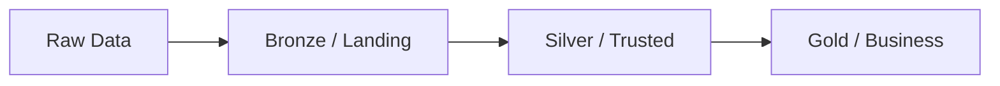
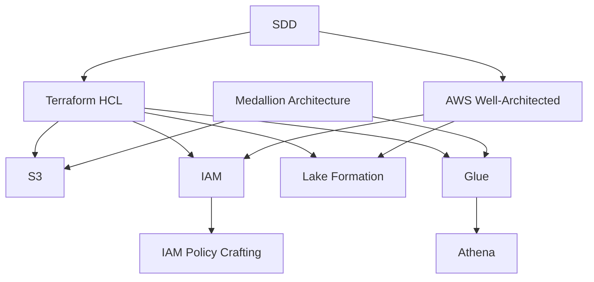

# Skill — AWS Data Lakehouse Agent Skills

> **Agent Skills** defining domain knowledge and expertise areas
> required for implementing and maintaining the AWS Data Lakehouse project.

---

## Skill Index

| ID | Skill | Domain | Agent |
|---|---|---|---|
| SK-001 | Terraform HCL | Infrastructure as Code | `@terraform-dev` |
| SK-002 | AWS S3 | Object Storage | `@architect`, `@terraform-dev` |
| SK-003 | AWS IAM | Identity & Access Management | `@security`, `@terraform-dev` |
| SK-004 | AWS Lake Formation | Data Governance | `@security`, `@data-engineer` |
| SK-005 | AWS Glue | Data Catalog & ETL | `@data-engineer` |
| SK-006 | AWS Athena | Serverless Analytics | `@data-engineer` |
| SK-007 | Medallion Architecture | Data Lake Design | `@architect` |
| SK-008 | Spec-Driven Development | Documentation | `@docs` |
| SK-009 | AWS Well-Architected | Best Practices | `@architect`, `@security` |
| SK-010 | IAM Policy Crafting | Security Policies | `@security` |

---

## SK-001: Terraform HCL

### Proficiency Level: Expert

### Knowledge Areas
- **Core Concepts:** Resources, data sources, providers, modules, state
- **Module Structure:** Standard layout (`main.tf`, `variables.tf`, `outputs.tf`, `data.tf`)
- **Expressions:** `jsonencode()`, `merge()`, `flatten()`, `for` expressions, conditionals
- **Meta-arguments:** `depends_on`, `count`, `for_each`, `provider`, `lifecycle`
- **AWS Provider:** Resources for S3, IAM, Lake Formation, Glue, Athena
- **State Management:** Local vs remote (S3 + DynamoDB), locking, workspaces
- **Variable Handling:** Type constraints, validation blocks, sensitive flag
- **Module Composition:** Module nesting, output propagation, cross-module references

### Project-Specific Patterns
```hcl
# Standard module structure
module "example" {
  source = "./modules/example"
  # Inputs from parent variables
  input1 = var.input1
  # Inputs from other module outputs
  input2 = module.other.output2
  depends_on = [module.other]
}
```

### Common Pitfalls
- Circular dependencies between modules
- Not using `depends_on` for Lake Formation resources
- Forgetting `jsonencode()` for IAM policies
- Mixing local and remote state

---

## SK-002: AWS S3

### Proficiency Level: Advanced

### Knowledge Areas
- **Bucket Configuration:** Naming conventions, region selection, `force_destroy`
- **Public Access Block:** All 4 settings for security
- **Encryption:** SSE-S3, SSE-KMS, SSE-C
- **Lifecycle Policies:** Transitions, expirations, filters
- **Versioning:** Suspend/enable, multi-factor auth delete
- **Logging:** Server access logs, object-level CloudTrail
- **Replication:** CRR, SRR, replica modifications

### Project-Specific Configuration
```hcl
# Standard bucket pattern
resource "aws_s3_bucket" "example" {
  bucket = var.buckets.example
  force_destroy = true
  tags = merge(var.tags, { Name = var.buckets.example })
}

resource "aws_s3_bucket_public_access_block" "example" {
  bucket = aws_s3_bucket.example.id
  block_public_acls       = true
  block_public_policy     = true
  ignore_public_acls      = true
  restrict_public_buckets = true
}
```

---

## SK-003: AWS IAM

### Proficiency Level: Advanced

### Knowledge Areas
- **Principals:** Users, groups, roles, service-linked roles
- **Policies:** Inline vs managed, customer vs AWS managed
- **Trust Policies:** Service trust, cross-account trust
- **Permission Boundaries:** Delegated administration
- **Policy Conditions:** `aws:SourceArn`, `aws:SourceAccount`, `aws:MultiFactorAuthPresent`
- **`sts:AssumeRole`:** Role chaining, session duration, external IDs
- **Access Analyzer:** Policy validation and findings

### Project-Specific Trust Pattern
```hcl
# Multi-service trust policy
assume_role_policy = jsonencode({
  Version = "2012-10-17"
  Statement = [
    {
      Effect = "Allow"
      Principal = { Service = ["glue.amazonaws.com", "states.amazonaws.com", ...] }
      Action = "sts:AssumeRole"
    }
  ]
})
```

---

## SK-004: AWS Lake Formation

### Proficiency Level: Advanced

### Knowledge Areas
- **Data Lake Settings:** Admin principals, hybrid mode
- **Resource Registration:** S3 locations, IAM role for access
- **Permissions Model:** Database, table, column, row, cell level
- **LF-Tags:** Tag-based access control, tag inheritance
- **Governed Tables:** ACID transactions, compaction, storage optimizers
- **Transactions:** Start, commit, cancel, extend
- **Cross-Account:** RAM sharing, resource links
- **Service-Linked Role:** `AWSServiceRoleForLakeFormationDataAccess`

### Important Constraint
> **IAM Groups cannot be used as Lake Formation principals directly.**
>
> **Workaround:** Create IAM roles for each access level, grant `sts:AssumeRole`
> to groups, and use the roles as LF principals.

### Project-Specific Permission Grant
```hcl
resource "aws_lakeformation_permissions" "example" {
  principal   = var.datalake_admins_principal_arn
  permissions = ["DESCRIBE", "SELECT", "ALTER", "INSERT", "DELETE"]
  table {
    database_name = var.databases.example
    wildcard      = true
  }
}
```

---

## SK-005: AWS Glue

### Proficiency Level: Intermediate

### Knowledge Areas
- **Data Catalog:** Databases, tables, partitions, versions
- **Table Schema:** Column types, SerDe, input/output formats
- **Partitioning:** Partition keys, partition indexes
- **ETL Jobs:** Spark scripts, job bookmarks, worker types
- **Crawlers:** Crawler configuration, schedule, schema updates
- **Connections:** JDBC, network, authentication
- **Workflows:** Trigger, job, crawler orchestration

### Project-Specific Table Pattern
```hcl
resource "aws_glue_catalog_table" "example" {
  name          = var.tables.example
  database_name = var.databases.example
  table_type    = "EXTERNAL_TABLE"
  parameters = {
    classification  = "parquet"
    compressionType = "snappy"
  }
  partition_keys {
    name = "event_date"
    type = "date"
  }
  storage_descriptor {
    location      = "s3://${var.buckets.example}/path/"
    input_format  = "org.apache.hadoop.hive.ql.io.parquet.MapredParquetInputFormat"
    output_format = "org.apache.hadoop.hive.ql.io.parquet.MapredParquetOutputFormat"
    ser_de_info {
      name                  = "parquet"
      serialization_library = "org.apache.hadoop.hive.ql.io.parquet.serde.ParquetHiveSerDe"
    }
  }
}
```

---

## SK-006: AWS Athena

### Proficiency Level: Intermediate

### Knowledge Areas
- **Engine:** Athena v2 (Trino-based), v3
- **Query Execution:** `StartQueryExecution`, `GetQueryResults`
- **Workgroups:** Configuration, output location, limits
- **Prepared Statements:** Parameterized queries
- **Federated Query:** Lambda connectors, data source connectors
- **Cost Control:** `LIMIT` clauses, `CTAS` for aggregation, partition pruning

---

## SK-007: Medallion Architecture

### Proficiency Level: Expert

### Architecture Layers



| Zone | Name in Project | Quality | Purpose |
|---|---|---|---|
| Bronze | Landing + Raw | Immutable, raw | Data ingestion, first copy |
| Silver | Trusted | Cleaned, validated | Analytics-ready, joined |
| Gold | Business | Aggregated, curated | Reporting, ML, dashboards |

### Best Practices
- Landing zone should be transient (data moves to raw quickly)
- Raw zone should be immutable (append-only)
- Trusted zone applies schemas and quality checks
- Business zone serves consumption (BI tools, Athena)

---

## SK-008: Spec-Driven Development (SDD)

### Proficiency Level: Advanced

### Process Flow
```
Spec (feature.md) → Plan (plan.md) → Implement (Terraform) → Verify (prod.md) → Document (agents.md + skill.md)
```

### Required Artifacts
| File | Purpose |
|---|---|
| `agents.md` | AI agent definitions and responsibilities |
| `plan.md` | Development roadmap, progress tracking |
| `feature.md` | Detailed feature specifications |
| `prod.md` | Production readiness checklist |
| `skill.md` | Domain knowledge for agents |

---

## SK-009: AWS Well-Architected Framework

### Proficiency Level: Intermediate

### Pillars
| Pillar | This Project |
|---|---|
| Operational Excellence | IaC with Terraform, automation scripts |
| Security | IAM least privilege, LF governance, S3 blocks |
| Reliability | Multi-AZ by default (AWS managed services) |
| Performance Efficiency | Serverless (Athena, Glue), partitioned tables |
| Cost Optimization | Lifecycle policies, serverless analytics |
| Sustainability | Efficient data storage, lifecycle management |

---

## SK-010: IAM Policy Crafting

### Proficiency Level: Advanced

### Policy Structure
```json
{
  "Version": "2012-10-17",
  "Statement": [
    {
      "Effect": "Allow",
      "Action": ["service:Action1", "service:Action2"],
      "Resource": "arn:partition:service:region:account:resource"
    }
  ]
}
```

### Project Patterns

**Service Role Policy:** Broad permissions across multiple services for ETL.

**Group AssumeRole Policy:** Minimal — only `sts:AssumeRole` on specific role ARN.

**LF Role Inline Policy:** Comprehensive admin permissions scoped to data lake resources.

### Least Privilege Guidelines
1. Never use `Resource: "*"` for S3 — scope to specific bucket ARNs.
2. Use `Condition` blocks with `aws:SourceArn` where possible.
3. Separate data plane vs control plane actions.
4. Group-related IAM actions together by service.
5. Use `jsonencode()` for Terraform readability.

---

## Skill Dependency Map


